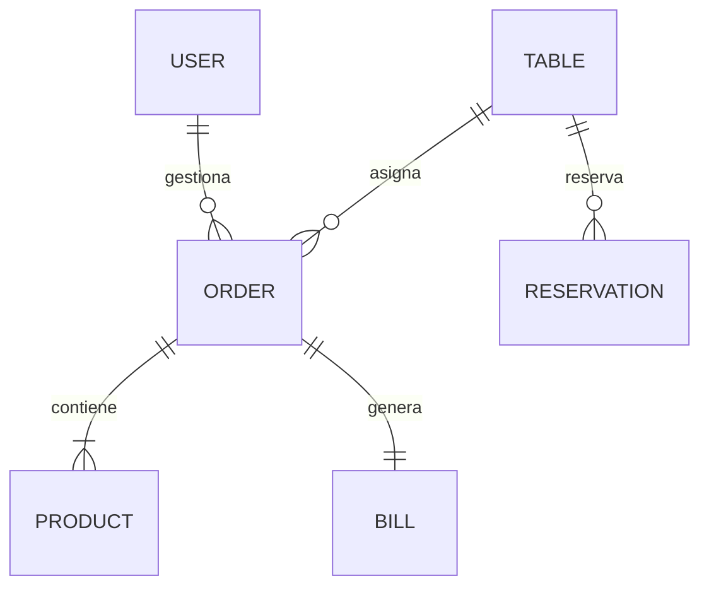

# 🍽️ Server Admin - API de Gestión de Restaurante

API RESTful para la gestión integral de un restaurante, incluyendo control de inventario, menú, reservaciones, empleados, ventas y facturación.

---

## 📝 Descripción

Servicio backend que proporciona endpoints para que administradores y personal gestionen las operaciones diarias del restaurante.

Incluye:

- Autenticación de usuarios para validar permisos.
- Gestión de imágenes del menú mediante Cloudinary.
- Sistema completo de pedidos, ventas y facturación.
- Control de mesas y reservaciones.
- Gestión de empleados e inventario.

---

## 🛠️ Tech Stack

- **Runtime:** Node.js 18+ (ESM)  
- **Framework:** Express 4.x  
- **Base de Datos:** MongoDB 8.x  
- **ODM:** Mongoose 8.x  
- **Autenticación:** Login manual (Validación de credenciales)  
- **Validación:** express-validator  
- **Storage:** Cloudinary (Imágenes de productos del menú)  
- **Seguridad:** Helmet, CORS, Rate Limiting  

---

## 🚀 Instalación

```bash
# Desde la raíz del proyecto
npm install
```

---

## ⚙️ Variables de Entorno

Crear un archivo `.env` en la raíz del proyecto:

```env
# Server
PORT=3001

# MongoDB
URI_MONGODB=mongodb://127.0.0.1:27017/restaurantSystem

# Cloudinary (Upload de imágenes del menú)
CLOUDINARY_CLOUD_NAME=tu_cloud_name
CLOUDINARY_API_KEY=tu_api_key
CLOUDINARY_API_SECRET=tu_api_secret
```

---

## 📂 Estructura del Proyecto

```
restaurant-admin/
├── configs/             # Configuración de App y DB
├── src/
│   ├── Auth/            # Registro y Login
│   ├── User/            # Gestión de Usuarios
│   ├── Product/         # Menú con imágenes
│   ├── Inventory/       # Insumos
│   ├── Table/           # Gestión de mesas
│   ├── Reservation/     # Reservaciones
│   ├── Order/           # Pedidos de cocina
│   ├── Sale/            # Registro de ventas
│   ├── Employee/        # Recursos Humanos
│   └── Billing/         # Facturación
└── middlewares/         # Validadores y File Uploader
```

---

# 🎯 Endpoints Principales

## 🍽️ Menú (Productos)

| Método | Endpoint | Descripción |
|--------|----------|------------|
| GET | `/v1/products` | Listar todos los productos del menú |
| POST | `/v1/products` | Crear nuevo platillo (con imagen) |
| PUT | `/v1/products/:id` | Actualizar datos o imagen |

---

## 📅 Reservaciones

| Método | Endpoint | Descripción |
|--------|----------|------------|
| GET | `/v1/reservations` | Ver todas las reservaciones |
| POST | `/v1/reservations/save` | Crear una nueva reservación |
| DELETE | `/v1/reservations/:id` | Cancelar reservación |

---

## 🔐 Autenticación

| Método | Endpoint | Descripción |
|--------|----------|------------|
| POST | `/v1/auth/register` | Registrar nuevo administrador/empleado |
| POST | `/v1/auth/login` | Iniciar sesión en el sistema |

---

# 📊 Modelos de Base de Datos Principales

---

## 🍛 Product (Platillo del Menú)

```json
{
  "productId": "Number (Required, Unique)",
  "nombre": "String (Required)",
  "categoria": "String (Required)",
  "precio": "Number (Required)",
  "imagen_url": "String (Cloudinary Link)",
  "estado": "Enum ['Disponible', 'Agotado']"
}
```

---

## 🧾 Order (Pedido)

```json
{
  "orderId": "Number",
  "mesaId": "Number",
  "empleadoId": "Number",
  "estado": "Enum ['Pendiente', 'En Preparacion', 'Listo', 'Entregado']"
}
```

---

# 🗄️ Modelo de Base de Datos

A continuación se muestra la estructura de las colecciones principales y sus relaciones dentro del sistema:

---

## 📚 Estructura de Colecciones (Schemas)

| Colección | Campos Principales | Relación / Descripción |
|------------|-------------------|------------------------|
| **Users** | `_id`, `UserNIT`, `UserName`, `UserSurname`, `UserEmail`, `password`, `role` | Almacena administradores y personal. |
| **Products** | `_id`, `nombre`, `categoria`, `precio`, `imagen_url`, `estado` | Platillos y bebidas del menú. |
| **Tables** | `_id`, `numeroMesa`, `capacidad`, `estado` (Disponible/Ocupada) | Gestión física del restaurante. |
| **Reservations** | `_id`, `fecha`, `hora`, `cliente`, `mesaId`, `estado` | Relacionada con **Tables**. |
| **Orders** | `_id`, `mesaId`, `empleadoId`, `productos`, `total`, `estado` | Relaciona **Users**, **Tables** y **Products**. |
| **Bills** | `_id`, `orderId`, `fechaEmision`, `nitCliente`, `total` | Generada a partir de una **Order**. |

---

## 🔗 Diagrama de Relaciones (Lógica del Sistema)



---

# 🛠️ Scripts Disponibles

```bash
# Iniciar servidor en modo desarrollo
npm run dev

# Iniciar servidor en producción
npm start
```

---

# 👨‍💻 Proyecto Académico

Desarrollado como práctica académica para la implementación de APIs RESTful utilizando Node.js, Express y MongoDB en un sistema completo de administración de restaurante.

---
